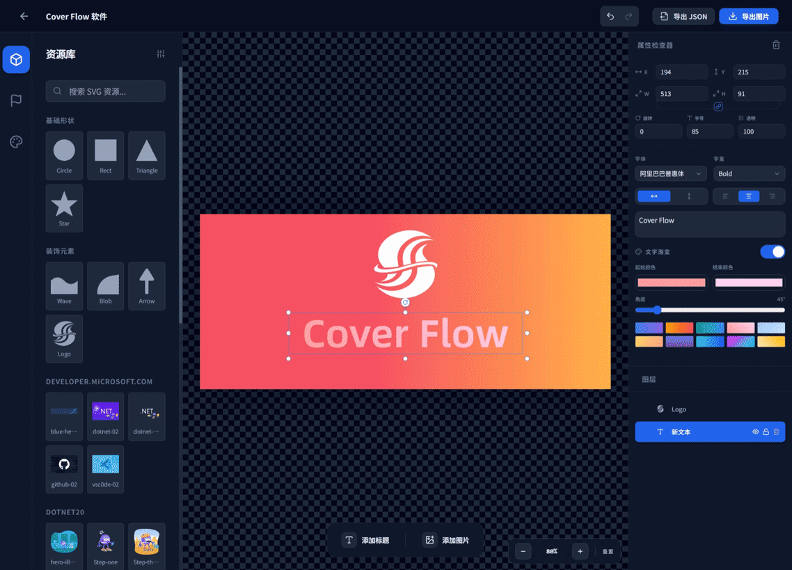

CoverFlow - 专业 SVG 文章封面设计器
=====================================

面向多平台文章封面图的 Web 设计工具。基于 SVG 资源库与图层系统，提供可配置画布、快速排版、背景生成与项目保存导出能力，适合日常内容运营与设计协作。



核心功能
--------

### 存储方式

- 本地存储：使用 LocalStorage 保存项目数据，适合单用户使用
- 本地文件系统：利用 File System Access API 直接读写用户文件（需 HTTPS 环境）

### 画布系统

- 多比例画布：内置微信文章封面比例（2.35:1、1:1），同时可自定义
- 画布控制：缩放、滚动平移、重置缩放

### SVG 资源管理

- 分类资源库：内置基础图形、装饰元素、可加载用户自定义SVG资源文件夹
- 搜索与过滤：按名称关键词筛选

### 图标库

- 集成 Font Awesome 图标库（需手动加载数据）
- 启用方式：从 Font Awesome 下载 `icon-families.json` 与 `categories.yml`，在图标库面板上传后即可使用
- 支持搜索与分类浏览，一键添加到画布生成图层

### 图层编辑系统

- 图层面板：列表展示全部图层
- 图层操作：
	- 位置调整（XY 拖拽 / 精确数值输入）
	- 缩放（等比 / 非等比，拖拽 / 数值控制）
	- 旋转（自由旋转 / 15 度步进）
	- 顺序调整（拖拽排序）
	- 显示 / 隐藏 / 锁定
- 文本增强：文字渐变
- 历史操作：撤销 / 重做

### 背景系统

- 纯色 / 线性渐变 / 图片背景
- 叠加纹理：条纹、网格、波点
- 背景图片：上传或链接
- 预置背景：常用渐变方案与自定义预设

### 导出与分享

- 图片导出：项目列表快速导出仅支持 PNG，编辑页面可导出 PNG/JPEG/WEBP 格式，并支持自定义分辨率和压缩质量
- 项目文件格式：JSON 保存项目状态
	- 图层信息、位置、样式
	- SVG 和 图像资源

### 项目管理

- 本地项目列表：浏览最近项目
- 项目导入 / 导出：支持 cfj 后缀的 JSON 格式项目文件，便于备份与分享

### 剪贴板与快速添加

- 粘贴 JSON：应用到当前项目，不修改项目 ID 和标题
- 粘贴文本：快速生成文本图层
- 粘贴 SVG 代码 / SVG 文件：快速生成 SVG 图层
- 粘贴图片文件：快速生成图片图层

快捷键
------

- Delete / Backspace：删除选中图层
- Arrow Keys：1px 移动
- Shift + Arrow：10px 移动
- Ctrl + J：克隆选中图层
- Ctrl + G：组合图层
- Ctrl + 上下：调整图层层级
- Ctrl + 左右：调整旋转角度
- Enter：编辑文本图层，也可以使用双击
- Ctrl + Z：撤销
- Ctrl + Y：重做
- Ctrl + S：保存项目

技术栈
------

- React 19 + TypeScript
- Vite 6
- Tauri
- tailwindcss
- html-to-image（导出）

本地开发
--------

前置要求：Node.js 18+（推荐 20+）

```bash
npm install
npm run dev
```

构建与预览：

```bash
npm run build
npm run preview
```

目录结构
--------

```
.
├─ components/         # UI 组件与面板
├─ utils/              # 工具函数
├─ App.tsx             # 应用入口
├─ constants.ts        # 常量与默认配置
├─ types.ts            # 类型定义
└─ translations.ts     # 文案与多语言
```

许可协议
--------

Apache License 2.0
